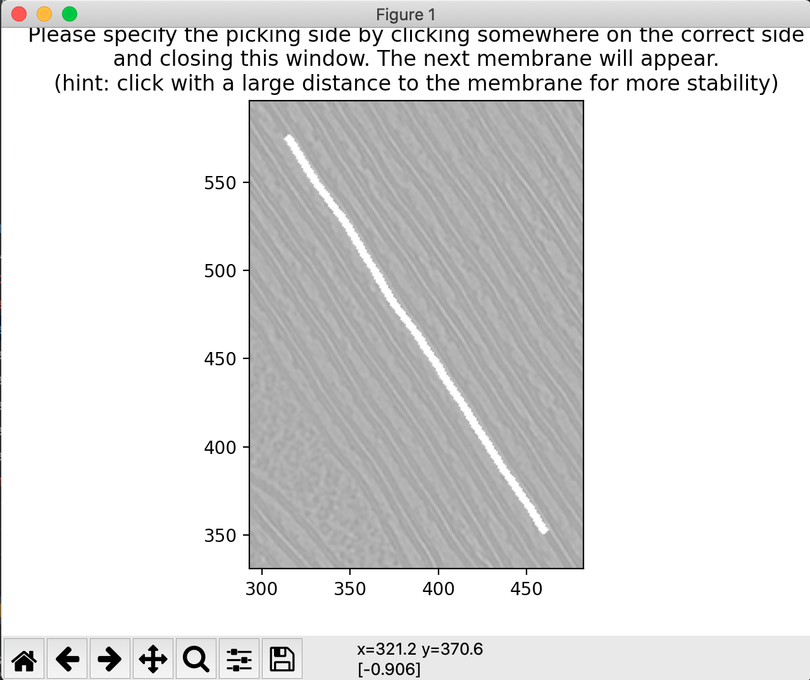
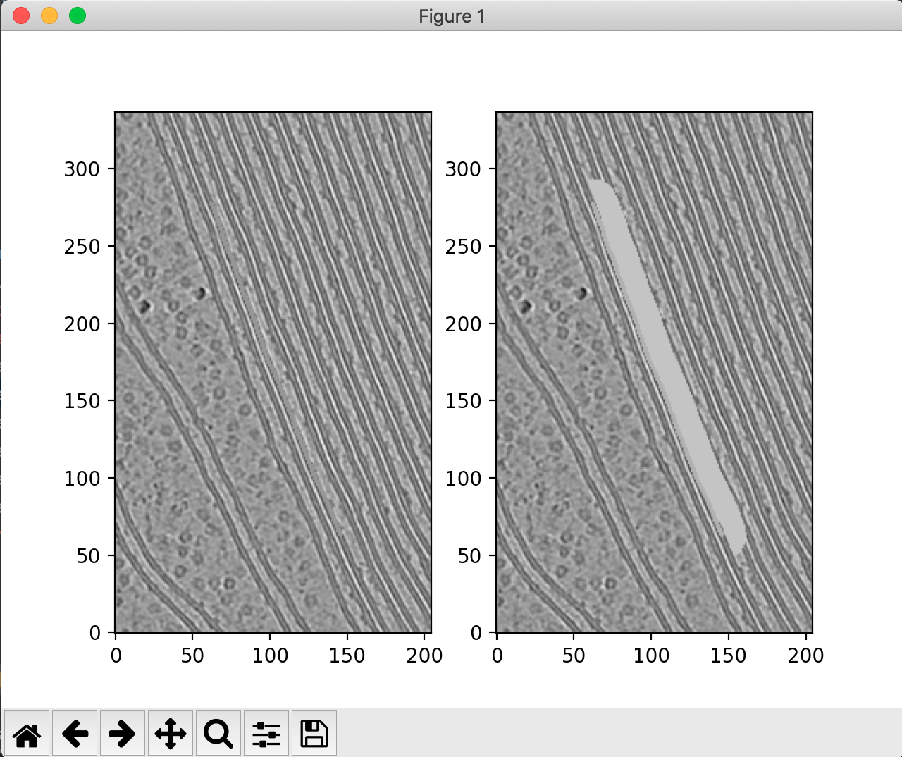
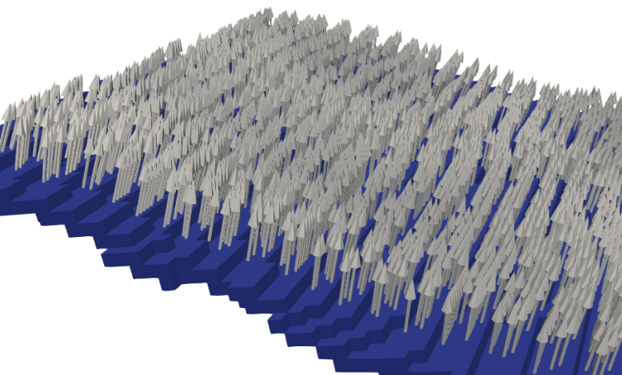
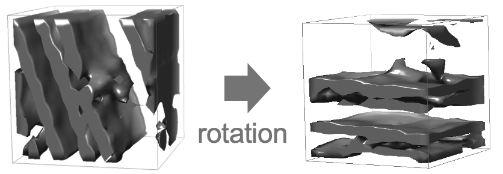
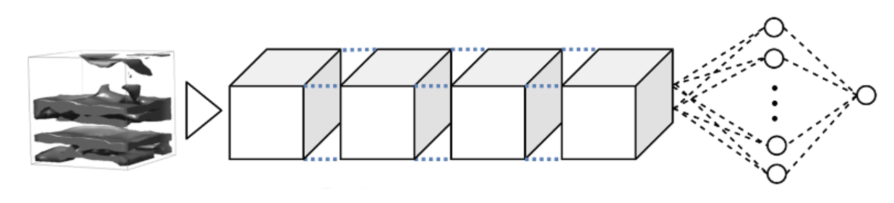
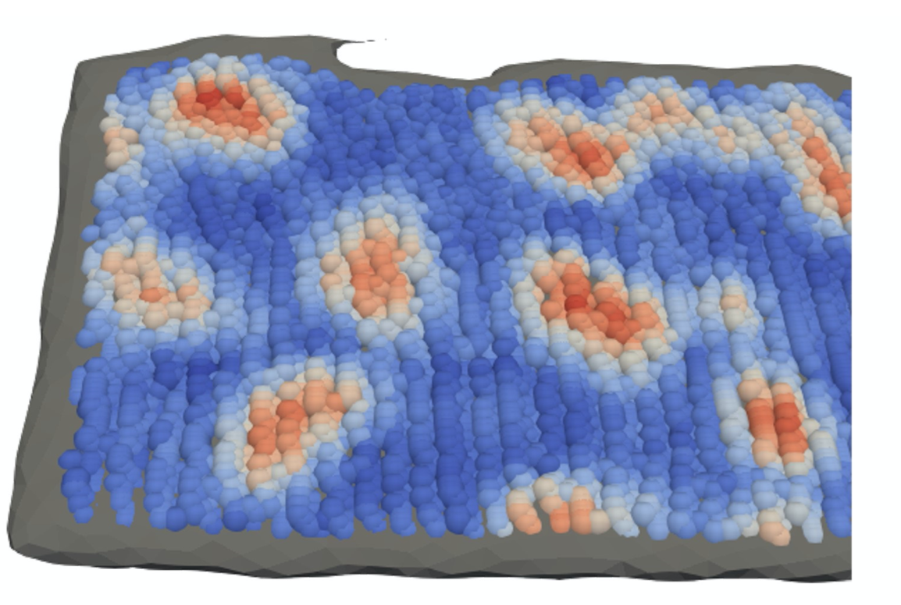
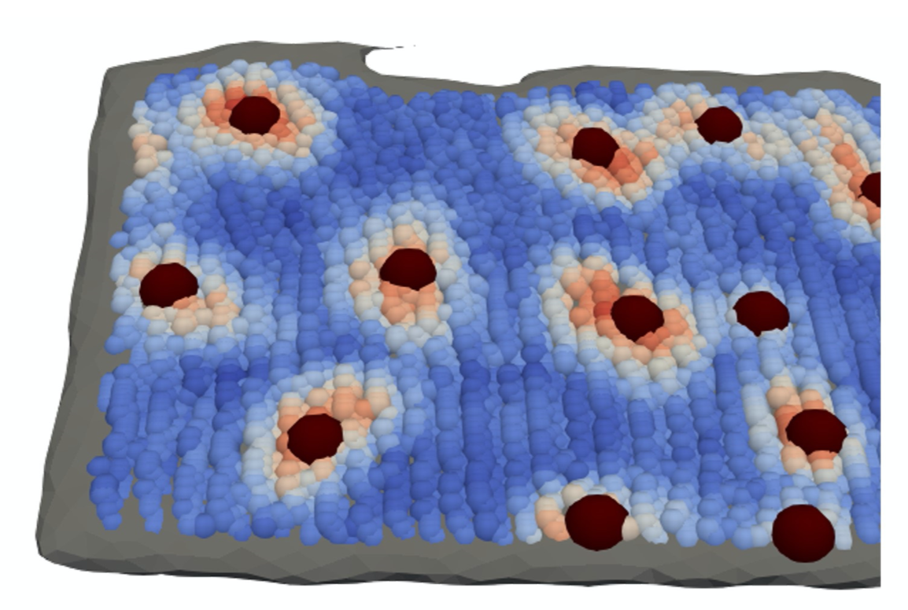

# MemBrain
### Automated detection of membrane-bound proteins

MemBrain is a pipeline for the automated detection of membrane-bound proteins in cryo-electron tomograms. It utilizes 
the geometry of a pre-segmented membrane to reduce the complexity of the detection task. As a result, MemBrain only requires a small amount of 
annotated data (even one single annotated membrane can be enough!) and can generalize well to unseen tomograms and membranes.

For user instructions, jump [here](#instructions). For trouble shooting, jump [here](#troubleshooting).

### Workflow
#### Inputs
MemBrain takes as an input the 3D segmentation of a membrane, together with the respective tomogram (both in .mrc or .rec format). 

For re-training MemBrain, .csv files or .xml files containing particle positions are required. It is optimized for particle positions outputs 
generated by Membranorama (https://github.com/dtegunov/membranorama) in .xml format. For also taking into account the particle shapes (e.g. elliptic), one will also require low-resolution particle models 
(the ones mapped onto the Membranorama densities), as well as the mesh files corresponding to the membrane segmentations (again, the ones used in Membranorama).
#### Create data structure
see [here](#data-structure).

#### User input
As a first step, the user has to choose, which side to pick particles on. For this, the segmentations are visualized and the user is required to click on the correct side of the membrane. (Hint: Maximize the distance between point and membrane for a more robust side-picking).
Currently, this only works for sheet-like membranes. For other membrane types, you can contact me and we can try to find a solution (lorenz.lamm@helmholtz-muenchen.de).

<p align="center">

</p>

#### Points and normals sampling
According to the user's choice, points are sampled on one side of a membrane, together with their respective normal vectors. A normal voting procedure is performed to make the normal vectors more robust.

To confirm that the correct side was picked, you can run the script "step1b_inspect_picked_sides.py".

<p align="center">

</p>

#### Subvolume sampling and preprocessing
In the next step, around each sampled position, a small cubic subvolume is sampled. It will later serve as our input to the neural network and will be assigned a score based on its distance to the next particle center.

After sampling the subvolumes, each of them is normalized by aligning the contained membrane to the subvolume's x-y-plane. For this, the previously sampled normal vector is used. We rotate the subvolume, s.t. the normal vector now points upwards, i.e., it is parallel to the z-axis.

<p align="center">

</p>
    
#### Training the neural network
For training the neural network, ground truth positions are required. This pipeline is designed for using ground truth generated by manual clicking in Membranorama. However, there is also the possibility to use csv files containing the ground truth particle positions. For any other kind of ground truth data, feel free to contact me so we can adjust the data loading.

Using the GT positions, we can compute distances to the nearest particle centers for each sampled point and thus also for each extracted subvolume. We train the neural network to predict this distance to the nearest particle centers using Mean Squared Error loss.
(The current version of MemBrain also allows for generating multiple NN outputs corresponding to distances to different particle classes)

<p align="center">

</p>
    
#### Inference on unseen data
Next, the neural network can be applied to data generated in the same steps as the training data (except that no ground truth positions are necessary). This results in a heatmap that tells us the predicted distances of each sampled position to their respective closest particle centers.

<p align="center">

</p>
    
#### Extraction of particle centers
In a final step, we can extract particle positions from the generated heatmaps. For this, we threshold the predicted distances and perform Mean Shift clustering on the remaining points. The predicted distances are used to "guide" the clustering algorithm towards cluster centers by assigning higher weights to points with lower predicted distances.

The output of this step is a .csv file containing the computed particle locations, as well as a .vtp file, which can be visualized, e.g. using Paraview.

<p align="center">

</p>
    
<a name="instructions"></a>
## User instructions
The following instructions show the required data structure and give hints on how to properly use the scripts.

### Data structure
MemBrain relies on a specific data structure, where tomograms, membrane segmentations, membrane meshes, and ground truth positions should be stored:
```
tomograms
│
└───Tomo1
│   │   Tomo1_(...)_bin4_denoised.rec
|   |   Tomo1_(...)_bin4_dose-filt.rec
│   │   Remarks: "_denoised" token should be added in case you want to decide later which version to use; "bin4" token is recommended (or respective other binning)
│   │
│   └───membranes
│   │       T1S1M1.mrc
│   │       T1S18M23.mrc
│   │       T1S19M1.mrc
│   │       ...
│   │       Remarks: stack token (S1, S18, ...) and membrane token (M1, M23, ...) should be included in filenames, ending with (membrane_token + ".mrc")
|   |
│   └───meshes
│   │       T1S1M1.obj
│   │       T1S18M23.obj
│   │       T1S19M1.obj
│   │       ...
│   │       Remarks: folder only necessary when training with membranorama data and using orientations; files should have names corresponding to membrane segmentations
|   |   
│   └───positions
│   │       T1S1M1.xml
│   │       T1S18M23.xml
│   │       T1S19M1.xml
│   │       ...
│   │       Remarks: folder only necessary for training. Files shoud be named corresponding to membrane segmentations.
|
└───Tomo23
    │   Tomo23_(...)_bin4_denoised.mrc
    │   Tomo23_(...)_bin4_dose-filt.mrc
```

### Setting up the environment
For the correct Python environment, set up a virtual environment of Python 3.8 (e.g. using [miniconda](https://docs.conda.io/projects/conda/en/latest/user-guide/install/linux.html)). Then activate the environment and install the required packages using
```
pip install -r requirements.txt
```

### Script usage
#### 0. Adjust config file
First, open the config file (config.py) and adjust the values according to your needs.

#### 1. Choose the correct picking sides of your membranes and sample points.
Run the command
```
python step1_sample_points.py
```
This will first generate the new pipeline directory. Then, it will display the membrane segmentations one by one and lets you choose the side of the membrane to pick points on. Clicking a point with a relatively large distance to the membrane segmentation makes the side-picking more robust.

Afterwards, points and corresponding membrane normal vectors are sampled. Using the command 
```
python step1b_inspect_picked_sides.py
```
you can inspect the picked sides of the membranes and verify whether they are correct.

#### 2. Extract subvolumes
For the extraction and preprocessing of subvolumes, run
```
python step2_create_subvolumes.py
```
In the config file, you can specify the size of the extracted subvolumes, as well as the cutoff value for the low-pass filter applied to the tomogram beforehand.

#### 3.1. Train the neural network
In case you don't want to use a pre-trained network, you will need to train MemBrain yourself. You can do this using 
```
python step3a_training.py --cktp /path/to/previous/ckpt
```
The flag --ckpt is optional. If you want to continue training from a previously trained model, you can specify the path to that model here.

Again, you can specify training parameters in the config file, such as number of epochs, batch size, cutoff for particle distances, and particles to use for distance computation, in the config file.

Trained models and checkpoints will be stored in the folder "lightning_logs".

#### 3.2. Inference on data
Apply the trained model on unseen data by using 
```
python step3b_predict_heatmaps.py /path/to/trained/model
```
This time, the path to the trained model is not optional, as we need to have a trained model for inference.

Executing this script will generate heatmaps for each membrane and for each particle class specified in the training parameters (config file). They are stored as .csv files and as .vtp files. The latter ones can easily be inspected, e.g. in Paraview.

#### 4. Find particle center positions
Finally, we can run the script
```
python step4_extract_particle_centers.py --eval True
```
--eval is again an optional argument. If set to True, evaluation metrics will be computed, such as the Chamfer distance between prediction and ground truth positions, as well as hit statistics based on various hit threshold distances.

In the config file, you can also specify the bandwidths that should be used for clustering. (Per clustering, only one is used. Setting multiple bandwidths can help to compare them). 

Outputs will be particle centers in .csv and .vtp format, stored in the folder particle_centers/raw/

#### Outlook
In further versions, I will add functionalities for computing particle orientations or a network for the classification of different particles.

<a name="troubleshooting"></a>
### Troubleshooting
- Loss is very high (1e2 and above): Most likely the labels have not been set correctly. Example problem for Membranorama: Membranorama stores positions based on actual pixel spacing, which it receives from a tomograms header. So if the tomogram’s header has pixel spacing 1.0 (often the case after some preprocessing with Python, e.g. CryoCARE), the Membranorama output positions will not show the exact positions w.r.t. pixel spacing.
Possible solutions:
  - Adjust Membranorama positions (multiply by pixel spacing)
  - Set tomogram pixel spacing to 1.0 in MemBrain pipeline (will lead to further adjustments, e.g. when choosing particle radius)
