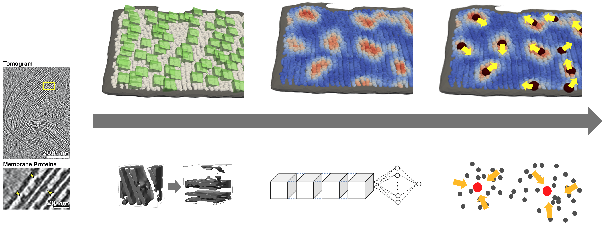

# MemBrain
### Automated detection of membrane-bound proteins

<p align="center">

</p>

<br>

This is the code accompanying our publication https://www.biorxiv.org/content/10.1101/2022.03.01.480844v1?rss=1 .

MemBrain is a pipeline for the automated detection of membrane-bound proteins in cryo-electron tomograms. It utilizes 
the geometry of a pre-segmented membrane to reduce the complexity of the detection task. As a result, MemBrain only requires a small amount of 
annotated data (even one single annotated membrane can be enough!) and can generalize well to unseen tomograms and membranes.

In this repository, we provide all code that is necessary to either
- train a MemBrain model from scratch, or
- predict particle locations on segmented membranes using a pre-trained model (see folder `./models`).


You can learn more about the workflow of our method [here](https://github.com/CellArchLab/MemBrain/blob/master/workflow.md).

For user instructions, jump [here](#instructions). For instructions on how to use our example dataset, jump [here](#example-data). For trouble shooting, jump [here](#troubleshooting).


<a name="instructions"></a>
## User instructions
The following instructions show the required data structure and give hints on how to properly use the scripts.

### Data structure
MemBrain relies on a specific data structure, where tomograms, membrane segmentations, membrane meshes, and ground truth positions should be stored:
```
tomograms
│
└───Tomo1
│   │   Tomo1_(...)_bin4_denoised.rec
|   |   Tomo1_(...)_bin4_dose-filt.rec
│   │   Remarks: "_denoised" token should be added in case you want to decide later which version to use; "bin4" token is recommended (or respective other binning)
│   │
│   └───membranes
│   │       T1S1M1.mrc
│   │       T1S18M23.mrc
│   │       T1S19M1.mrc
│   │       ...
│   │       Remarks: stack token (S1, S18, ...) and membrane token (M1, M23, ...) should be included in filenames, ending with (membrane_token + ".mrc")
|   |
│   └───meshes
│   │       T1S1M1.obj
│   │       T1S18M23.obj
│   │       T1S19M1.obj
│   │       ...
│   │       Remarks: folder only necessary when training with membranorama data and using orientations; files should have names corresponding to membrane segmentations
|   |   
│   └───positions
│   │       T1S1M1.xml
│   │       T1S18M23.xml
│   │       T1S19M1.xml
│   │       ...
│   │       Remarks: folder only necessary for training. Files shoud be named corresponding to membrane segmentations.
|
└───Tomo23
    │   Tomo23_(...)_bin4_denoised.mrc
    │   Tomo23_(...)_bin4_dose-filt.mrc
```

### Setting up the environment
For the correct Python environment, set up a virtual environment of Python 3.8 (e.g., using [miniconda](https://docs.conda.io/projects/conda/en/latest/user-guide/install/linux.html)). When using Miniconda, the following commands can be performed, after Miniconda is installed:
```
conda create --name MemBrain_Venv python==3.8
conda activate MemBrain_Venv
git clone https://github.com/CellArchLab/MemBrain.git
cd MemBrain
pip install -r requirements.txt
```

### Script usage
#### 0. Adjust config file
First, open the config file (config.py) and adjust the values according to your needs.

#### 1. Choose the correct picking sides of your membranes and sample points.
Run the command
```
python step1_sample_points.py
```
This will first generate the new pipeline directory. Then, it will display the membrane segmentations one by one and lets you choose the side of the membrane to pick points on. Clicking a point with a relatively large distance to the membrane segmentation makes the side-picking more robust.

Afterwards, points and corresponding membrane normal vectors are sampled. Using the command 
```
python step1b_inspect_picked_sides.py
```
you can inspect the picked sides of the membranes and verify whether they are correct.

#### 2. Extract subvolumes
For the extraction and preprocessing of subvolumes, run
```
python step2_create_subvolumes.py
```
In the config file, you can specify the size of the extracted subvolumes, as well as the cutoff value for the low-pass filter applied to the tomogram beforehand.

#### 3.1. Train the neural network
In case you don't want to use a pre-trained network, you will need to train MemBrain yourself. You can do this using 
```
python step3a_training.py --cktp /path/to/previous/ckpt
```
The flag --ckpt is optional. If you want to continue training from a previously trained model, you can specify the path to that model here.

Again, you can specify training parameters in the config file, such as number of epochs, batch size, cutoff for particle distances, and particles to use for distance computation, in the config file.

Trained models and checkpoints will be stored in the folder `lightning_logs`.

#### 3.2. Inference on data
Apply the trained model on unseen data by using 
```
python step3b_predict_heatmaps.py /path/to/trained/model
```
This time, the path to the trained model is not optional, as we need to have a trained model for inference.

Executing this script will generate heatmaps for each membrane and for each particle class specified in the training parameters (config file). They are stored as .csv files and as .vtp files. The latter ones can easily be inspected, e.g. in Paraview.

#### 4. Find particle center positions
Finally, we can run the script
```
python step4_extract_particle_centers.py --eval True
```
--eval is again an optional argument. If set to True, evaluation metrics will be computed, such as the Chamfer distance between prediction and ground truth positions, as well as hit statistics based on various hit threshold distances.

In the config file, you can also specify the bandwidths that should be used for clustering. (Per clustering, only one is used. Setting multiple bandwidths can help to compare them). 

Outputs will be particle centers in .csv and .vtp format, stored in the folder particle_centers/raw/`

### Example data
For testing the functionality of MemBrain, we provide a toy dataset, containing 3 membranes from one tomogram (https://elifesciences.org/articles/53740). Instructions how to use it can be found here:

#### Data preparation
The corresponding ground truth data positions, as well as membrane meshes are provided without requiring further processing.
For membrane segmentations, and the raw tomogram, please open a terminal in the MemBrain folder and run

```sh prepare_toy_dataset.py```

#### Adjustments of config.py
Ideally, this toy example should work without adjusting config file values. However, if problems with the paths arise, changing to absolute paths might help:
- PROJECT_NAME (can also stay the same)
- PROJECT_DIRECTORY (this is where all outputs of MemBrain are stored; directory should exist beforehand)
- TOMO_DIR (where your toy_data tomograms are stored, e.g., `/path/to/MemBrain/folder/MemBrain/toy_data/tomograms`)
- USE_GPU (do you have GPU available? This will speed up training / inference)

#### Script execution
The remaining instructions for this toy dataset are analogous to the common script executions, see [here](#setting-up-the-environment).


<a name="troubleshooting"></a>
### Troubleshooting
- Loss is very high (1e2 and above): Most likely the labels have not been set correctly. Example problem for Membranorama: Membranorama stores positions based on actual pixel spacing, which it receives from a tomograms header. So if the tomogram’s header has pixel spacing 1.0 (often the case after some preprocessing with Python, e.g. CryoCARE), the Membranorama output positions will not show the exact positions w.r.t. pixel spacing.
Possible solutions:
  - Adjust Membranorama positions (multiply by pixel spacing)
  - Set tomogram pixel spacing to 1.0 in MemBrain pipeline (will lead to further adjustments, e.g. when choosing particle radius)
