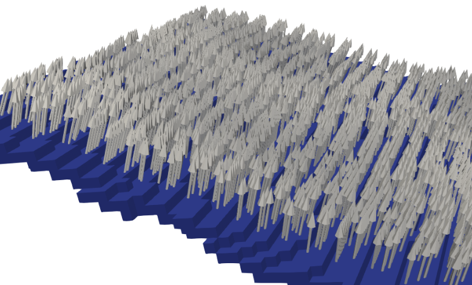
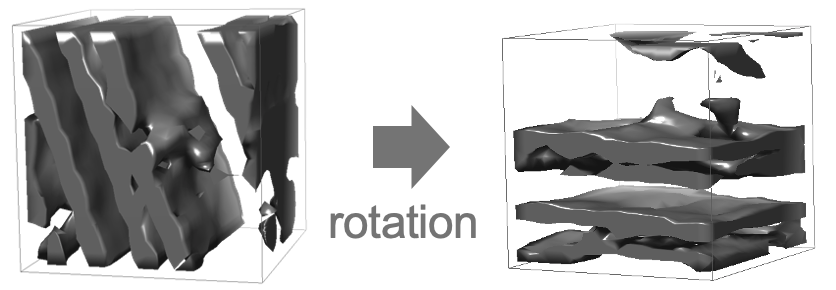
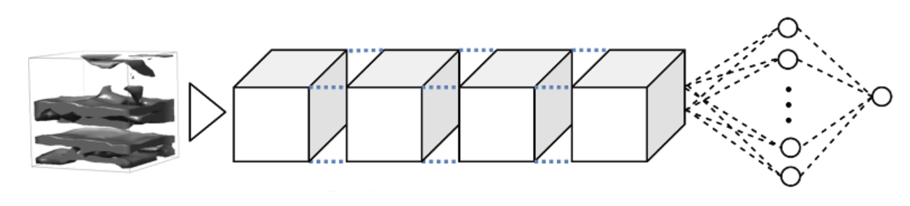

### Workflow
#### Inputs
MemBrain takes as an input the 3D segmentation of a membrane, together with the respective tomogram (both in .mrc or .rec format). 

For re-training MemBrain, .csv files or .xml files containing particle positions are required. It is optimized for particle positions outputs 
generated by Membranorama (https://github.com/dtegunov/membranorama) in .xml format. For also taking into account the particle shapes (e.g. elliptic), you will require low-resolution particle models 
(the ones mapped onto the Membranorama densities), as well as the mesh files corresponding to the membrane segmentations (again, the ones used in Membranorama).
#### Create data structure
See [here](#data-structure).

#### User input
As a first step, the user has to choose, which side to pick particles on. For this, the segmentations are visualized and the user is required to click on the correct side of the membrane. (Hint: Maximize the distance between point and membrane for a more robust side-picking).
Currently, this only works for sheet-like membranes. For other membrane types, you can contact me and we can try to find a solution (lorenz.lamm@helmholtz-muenchen.de).

#### Points and normals sampling
According to the user's choice, points are sampled on one side of a membrane, together with their respective normal vectors. A normal voting procedure is performed to make the normal vectors more robust.

To confirm that the correct side was picked, you can run the script `step1b_inspect_picked_sides.py`.

#### Subvolume sampling and preprocessing
In the next step, around each sampled position, a small cubic subvolume is sampled. It will later serve as our input to the neural network and will be assigned a score based on its distance to the next particle center.

After sampling the subvolumes, each of them is normalized by aligning the contained membrane to the subvolume's x-y-plane. For this, the previously sampled normal vector is used. We rotate the subvolume, s.t. the normal vector now points upwards, i.e., it is parallel to the z-axis.

    
#### Training the neural network
For training the neural network, ground truth positions are required. This pipeline is designed for using ground truth generated by manual clicking in Membranorama. However, there is also the possibility to use csv files containing the ground truth particle positions. For any other kind of ground truth data, feel free to contact me so we can adjust the data loading.

Using the GT positions, we can compute distances to the nearest particle centers for each sampled point and thus also for each extracted subvolume. We train the neural network to predict this distance to the nearest particle centers using Mean Squared Error loss.
(The current version of MemBrain also allows for generating multiple NN outputs corresponding to distances to different particle classes)

    
#### Inference on unseen data
Next, the neural network can be applied to data generated in the same steps as the training data (except that no ground truth positions are necessary). This results in a heatmap that tells us the predicted distances of each sampled position to their respective closest particle centers.

    
#### Extraction of particle centers
In a final step, we can extract particle positions from the generated heatmaps. For this, we threshold the predicted distances and perform Mean Shift clustering on the remaining points. The predicted distances are used to "guide" the clustering algorithm towards cluster centers by assigning higher weights to points with lower predicted distances.

The output of this step is a .csv file containing the computed particle locations, as well as a .vtp file, which can be visualized, e.g. using Paraview.

